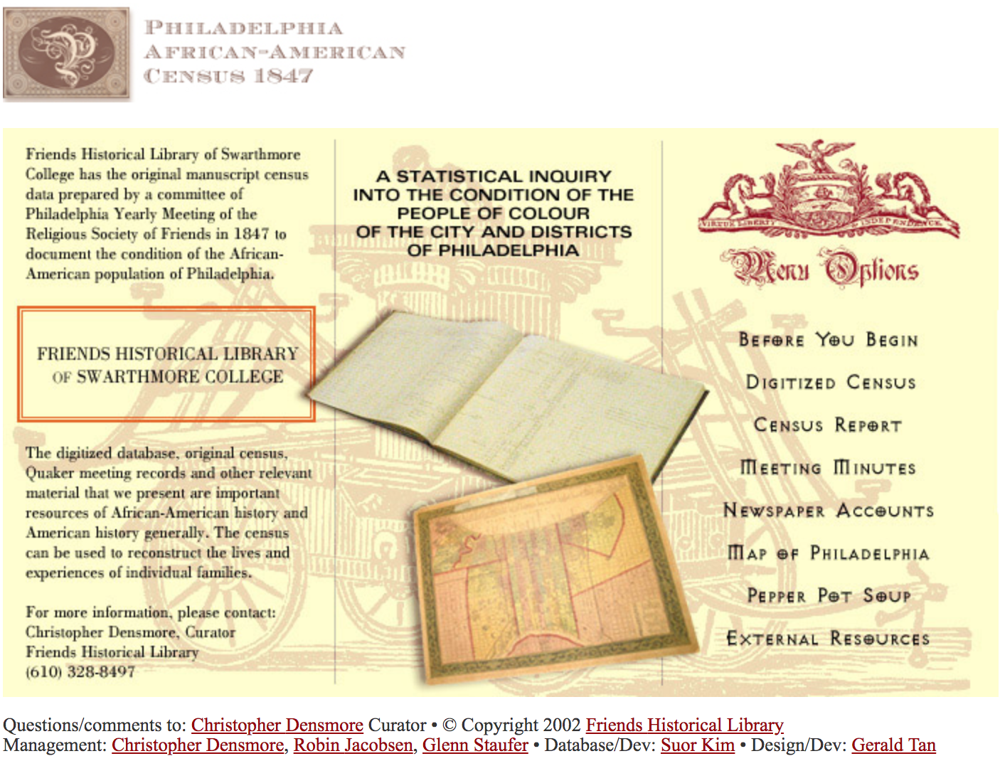

---

title: About
permalink: /about/
layout: default
---

 <h2>About the Census </h2>

<!--Add project intro-->

The manuscript 1847 census, containing forty-three elements of information for each of more than five thousand households in Philadelphia, was used to prepare <a href="https://raw.githubusercontent.com/swat-ds/datasets/main/1847census/paac1847censusreport.pdf"><em>A Statistical Inquiry into the Condition of the People of Colour of the City and Districts of Philadelphia</em></a> (1849), a report of forty-four pages. This is aggregated data-—the raw data of the census manipulated in particular ways for a particular purpose. The existence of the raw data allows modern researchers to reaggregate the data—to ask new questions and not be bound by the conceptions of social scientists of 160 years past.

The data also tells stories. The compilers were interested in the broad picture of the condition of the African American population. But each individual household record tells a story—how one particular family fared in 1847: what occupation, what property, what education, what pay. The information puts faces, or at least individual stories, to what is otherwise aggregate data. We have information on families nearly destitute, living in conditions of poverty; we have families apparently prospering. We can move from the micro to the macro view of the African American experience.

 Why was the census undertaken? The census was undertaken by a committee appointed by the Meeting for Sufferings of Philadelphia Yearly Meeting (Orthodox). The purpose of the committee initially was to prepare a report on the trading of enslaved people, but after further consideration, the committee determined that it was also important to examine the condition of the African American population of Philadelphia both to document the existence of an "industrious and thriving" portion of that population and to discover what portion of the community may have been in need of attention and assistance.

 The census data can be translated into human stories. Individual families have names and histories:

 - Amy Wood, widow, born into slavery and manumitted by Lucy Wood, sister to Patrick Henry; heading a family of five, three under fifteen, none born in Pennsylvania; two attending school, one "at service." Amy Wood is looking for work. The Wood family shared a room with Adeline Kelley, born into slavery, and manumitted by Ann Thomas Bedford, of Richmond, Virginia; her husband remains enslaved, probably in Virginia. She supports her family by washing, for which she receives $1.50 per week; none of her three children are in school, and two are working at the tobacco mill.
 - Robert F. Jones and wife, born free and in Pennsylvania. Robert teaches school for $200 a year, and receives another $150 teaching vocal music. The wife "keeps house." Both are literate and attend church.

The current project is intended to present the documentary resources of the 1847 to the widest possible audience through the web. We anticipate that some users will be researchers, interested in social science approaches to reconstructing the economic and social conditions of Philadelphia or a representative African-American community in the North prior to the Civil War. Other researchers may be interested in family genealogy, or trades and occupations.

We invite your comments on this project. [Please contact Friends Historical Library](http://www.swarthmore.edu/Library/friends) with your comments about the usefulness of this web site and suggestions for additions and improvements.

Christopher Densmore, Curator [2001-2018]  
Friends Historical Library  
April 23, 2002

 <h2>View the Original Ledgers</h2>

Scans of the original census ledgers are available through the <a href="https://digitalcollections.tricolib.brynmawr.edu/collections/philadelphia-african-american-census-1847">Tri-Co Digital Collections portal</a>.

 <h1>About this Site</h1>

<figure class="figure">
  <a href="https://web.archive.org/web/20190421015959/https://www.swarthmore.edu/Library/friends/paac1847/main.html">
  <figcaption class="figure-caption">Explore the original 2002 exhibit site.</figcaption>
   </a>
</figure>

 In 2002, Friends Historical Library of Swarthmore College launched an exhibit website about the 1847 Census, including a searchable database of census entries. In 2019, Friends Historical Library partnered with student fellows through [Swarthmore Projects for Educational Exploration & Development (SPEED)](https://www.swarthmore.edu/its/swarthmore-projects-educational-exploration-and-development-speed-program) to update and enhance the website: cleaning up the original data; creating a more accessible, interactive website; and designing visualizations to illuminate interesting findings of the census. In 2020, [Digital Scholarship at Swarthmore](https://www.swarthmore.edu/libraries/digital-scholarship) completed the work begun by the SPEED students and the 2002 site was retired.

